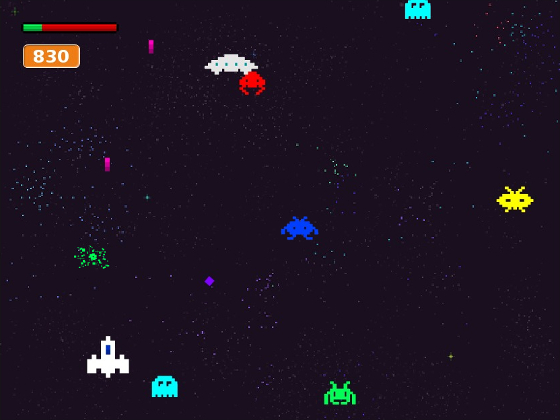

# CS50: Introduction to Computer Science

My solutions to problem sets and final project of [Harvard University's CS50](https://cs50.harvard.edu/) via [edX](https://www.edx.org/)

&nbsp; &nbsp;
***

### Table of Contents

* **Problem Sets**

  - [x] **[Problem Set 0: Scratch](https://github.com/bomholtm/cs50#problem-set-0-scratch)**
  - [x] **[Problem Set 1: C](https://github.com/bomholtm/cs50#problem-set-1-c)**
  - [x] **[Problem Set 2: Crypto](https://github.com/bomholtm/cs50#problem-set-2-crypto)**
  - [x] **[Problem Set 3: Game of Fifteen](https://github.com/bomholtm/cs50#problem-set-3-game-of-fifteen)**
  - [ ] **Problem Set 4: Forensics**
  - [ ] **Problem Set 5: Mispellings**
  - [ ] **Problem Set 6: Sentimental**
  - [ ] **Problem Set 7: C$50 Finance**
  - [ ] **Problem Set 8: Mashup**

* **Final Project**

  - [ ] :squirrel:

***

&nbsp; &nbsp;
### Problem Set 0: Scratch

* [Scratch](https://scratch.mit.edu/projects/120298616/#fullscreen)

  

&nbsp; &nbsp;
### Problem Set 1: C

* [Hello](https://github.com/bomholtm/cs50/tree/master/problem_set_1_c/hello.c)
* [Water](https://github.com/bomholtm/cs50/tree/master/problem_set_1_c/water.c)
* [Mario (More)](https://github.com/bomholtm/cs50/tree/master/problem_set_1_c/mario.c)
* [Credit](https://github.com/bomholtm/cs50/tree/master/problem_set_1_c/credit.c)

&nbsp; &nbsp;
### Problem Set 2: Crypto

* [Initials (More)](https://github.com/bomholtm/cs50/tree/master/problem_set_2_crypto/initials.c)
* [Caesar](https://github.com/bomholtm/cs50/tree/master/problem_set_2_crypto/caesar.c)
* [Vigenere](https://github.com/bomholtm/cs50/tree/master/problem_set_2_crypto/vigenere.c)

&nbsp; &nbsp;
### Problem Set 3: Game of Fifteen

* [Find (More)](https://github.com/bomholtm/cs50/tree/master/problem_set_3_game_of_fifteen/find)
* [Fifteen](https://github.com/bomholtm/cs50/tree/master/problem_set_3_game_of_fifteen/fifteen)

&nbsp; &nbsp;
### Problem Set 4: Forensics

* :squirrel:

&nbsp; &nbsp;
### Problem Set 5: Mispellings

* :squirrel:

&nbsp; &nbsp;
### Problem Set 6: Sentimental

* :squirrel:

&nbsp; &nbsp;
### Problem Set 7: C$50 Finance

* :squirrel:

&nbsp; &nbsp;
### Problem Set 8: Mashup

* :squirrel:
